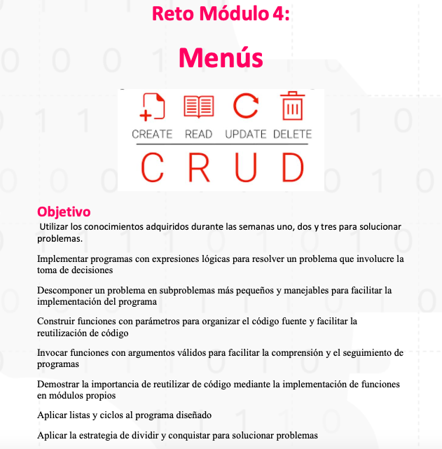
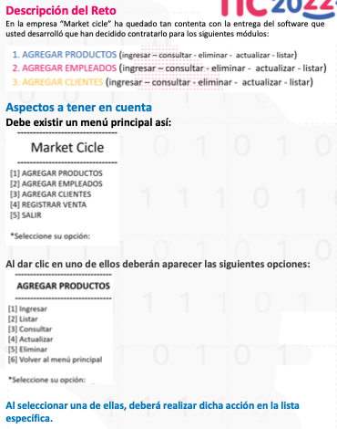
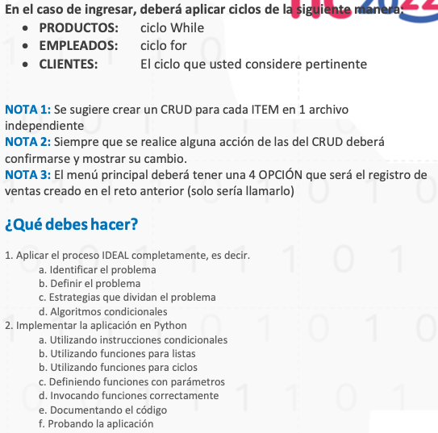
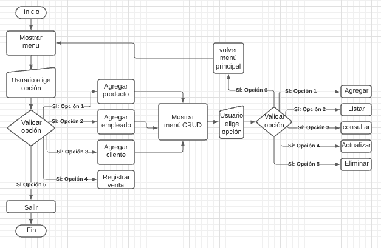

# reto_3-menus
Reto 3 - Menús -  Ciclo 1 - Fundamentos de programación - Universidad de Caldas - MisionTic

## Descripción del reto

## Solución
### I: Identificacion del problema
La empresa “Market cicle” desea un programa por medio del cual pueda realizar un registro, actualizacion y modificacion de empleados, productos clientes y ventas.

**¿Quiénes son los interesados?** 
Cliente = La empresa “Market cicle” 
Usuarios = directivos y empleados de la empresa Market cicle.

**¿Cuál es el objetivo?** Realizar un programa que muestre un menu donde el usuario pueda escoger entre las diferentes opciones y realizar un crud basico en el listado de empleados y productos. Adicional a esto, se debe incorporar en en el software actual el programa de registro de ventas hecho en el reto anterior.

**Se tienen restricciones?**

Los empleados cuentan con un codigo interno que deben ingresar al programa cada vez que realicen una venta, este codigo y registro se debe realicar por una sola venta.

### D: Definir el problema

**¿Qué conozco?**
Se debe realizar un software que contenga menus por medio de los cuales el usuario pueda realizar distintas operaciones de registro sobre productos, empleados, clientes y ventas.

**¿Que debo conocer?**
Condicionales logicas para el desarrollo del programa.
Manipulación de listas en el lenguaje python.

### E: Estrategias
Ejemplos particulares

Se muestra un menú principal con las siguientes opciones:
1. Agregar producto
2. Agregar empleado
3. Agregar cliente
4. Registrar venta
5. Salir

segun la opción que el usuario elija, el programa realizara las siguientes funciones:

- Si elige entre las opciones 1, 2 o 3, se mostrar el siguiente menu:

1. Ingresar
2. Listar
3. Consultar
4. Actualizar
5. Eliminar
6. Menú principal

- Si el usuario elige la opcion 4 el software lo dirigira a la funcionalidad de registro de venta, la cual fue realizada en el reto anterior y sera implementada en este reto.

- Si el usuario oprime la opcion 5 el programa dejara de ejecutarse.

Suponiendo que el usuario eligio la opción 1 en el el menú principal y luego de esto elige la opcion 1. en el menu secundario; el software le solicitara que ingrese el nombre del producto el cual desea ingresar al sistema, luego le pedira al usuario confirmacion si desea realizar esta operación, y por ultimo, este sera agregado a una lista llamada productos.

Con la opcion 2  del menu secundario el software mostrara el listado completo de productos, empleados o clientes segun la opción que se haya elegido en el menú principal.

Con la opcion 3 del menu secundario el software pedira al usuario que ingrese el nombre por medio del cual desea consultar productos, empleados o clientes segun la opción que se haya elegido en el menú principal, el programa confirmara al usuario si el dato se encuentra registrado.

Con la opcion 4 del menu secundario el software pedira al usuario que ingrese el nombre por medio del cual desea consultar productos, empleados o clientes segun la opción que se haya elegido en el menú principal, mostrara los datos del elemnto respectivo, el software le  preguntara al usuario si desea modificar algiuno se esos datos, en caso de que el usuario confirme, el software le pedira aal usuario que realice las modificaciones pertinents, luego le pedira al usuario confirmacion para guardar los cambios y los guardara.

### A: Algoritmos

